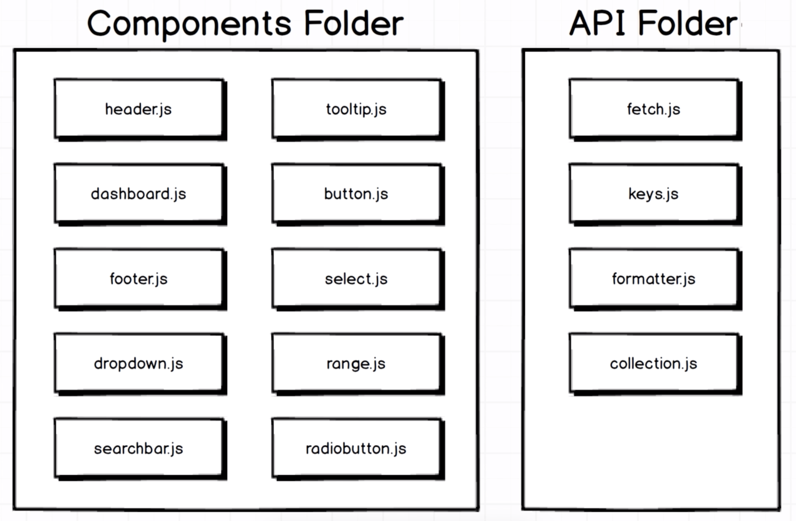
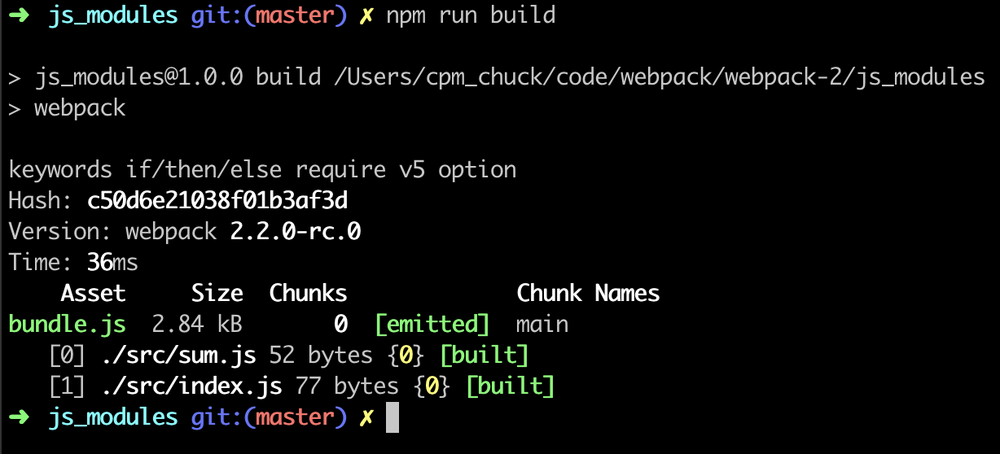

# Webpack 2

## Introdution
- Why do we need Webpack?
    - Server side templating: Back end server creates an HTML doc and sends it to the user.
    - Single page app: Server sends a bare-bones HTML doc to the user. Javascript runs on the users machine to assemble a full webpack.
    - Modern websites are using single page app. It relies on Javascript code that is executed on user's browser to assemble the entire web application, so we have huge pile of Javascript that is shipped down to user's browser. Webpack deals with this tremendous amount of Javascript code easier.
    - Problem: It's hard to update or change codes in single page app, because the source code is thousand or million lines of Javascript.
    - Javascript modules: It contains some small acount of code. But splitting project up into many separate files is not free, per se.
        
        1. Load order: You need to handle the order in which the code is executed.
        1. Performance: Having many JS files and loading them over an HTTP connection decreases the performance. The more files you have, the slower load time for the page.
    - The core purpose of Webpack: It takes big collection of tiny little JS modules and merge them all into one big JS file while also ensuring that each module is executed in the correct order.
        
- Module system

    Module System|Common Syntax
    --|--
    CommonJS|`module.exports`, `require`
    AMD|`define`, `require`
    ES2015|`export`, `import`

- Webpack in action
    1. Create a folder called `js_modules` and get in it.
        ```
        $ mkdir js_modules
        $ cd js_modules
        ```
    1. Make a new npm project. Just press enter to go through all questions.
        ```
        $ npm init
        ```
    1. You can see `package.json` is created.
        ```
        $ ls
        package.json
        ```
    1. Create a new folder called `src`, and create 2 files `index.js` and `sum.js` in this folder.
    1. Link files with CommonJS, notice that `sum.js` should be loaded before `index.js` in this case.
        ```js
        // sum.js
        const sum = (a, b) => a + b;

        module.exports = sum;
        ```
        ```js
        // index.js
        const sum = require('./sum');

        const total = sum(10, 5);
        console.log(total);
        ```
    1. Install Webpack 2.
        ```
        $ npm install --save-dev webpack@2.2.0-rc.0
        ```
    1. Move to folder `js_modules` and create a file `webpack.config.js`. In this file we can set up the configuration of webpack. There are 2 minimum properties that we have to define inside of this file.
        1. Entry property: In webpack project, we call the entry file of the application `index.js`. `index.js` is a entry point, so it only imports code to it and doesn't export anything and is not depended upon by anything else. When you refer to `index.js` as entry point (set it to entry property), webpack will do 2 things:
            - It will instruct webpack on the first file that it should execute when application starts up.
            - Entry file forms the start of the module-building process. So webpack will look at what entry point file imports and then look at what those files import and go on until the files which have no dependenies.
        1. Output property: It tells webpack where to take this big all `bundle.js`. The `path` property is a reference to the directory that the output file should be saved to. `filename` is what webpack should call the actual file that gets created. By convention, we name it `bundle.js`. Notice that you need to use absolute path in `path` property.
            ```js
            // This is handled by node.js runtime instead of webpack.
            const path = require('path');

            const config = {
                entry: './src/index.js',
                output: {
                    // Save output file called bundle.js inside of a path of the current working directory in a file called build.
                    path: path.resolve(__dirname, 'build'),
                    filename: 'bundle.js'
                }
            };

            module.exports = config;
            ```
    1. Open `package.json` file, add script as follows:
        ```js
        {
            ...
            "scripts": {
                "build": "webpack"
            },
            ...
        }
        ```
    1. Run webpack.
        ```
        $ npm run build
        ```
        
- Why should we use command `npm run build` instead of `webpack`?
    - `webpack`: Out of all globally installed modules, find the one called webpack and run it. So you need install webpack globally.
    - `npm run build`: Run the copy of webpack stored in the `node_modules` directory.
    - If different projects use different version of webpack, command `webpack` cannot handle it.
