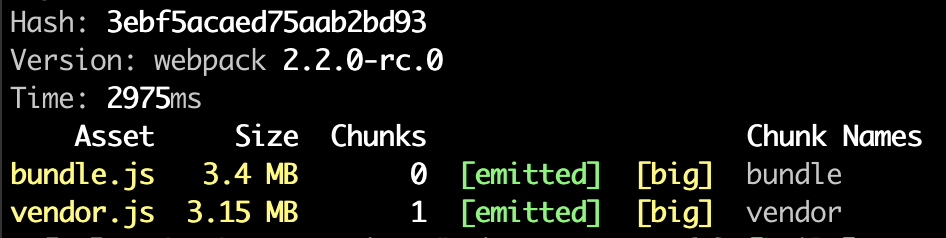
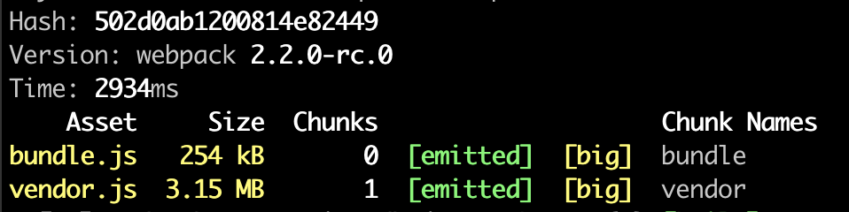
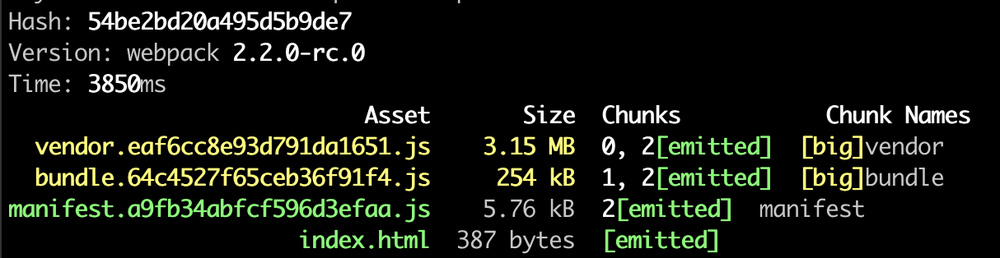
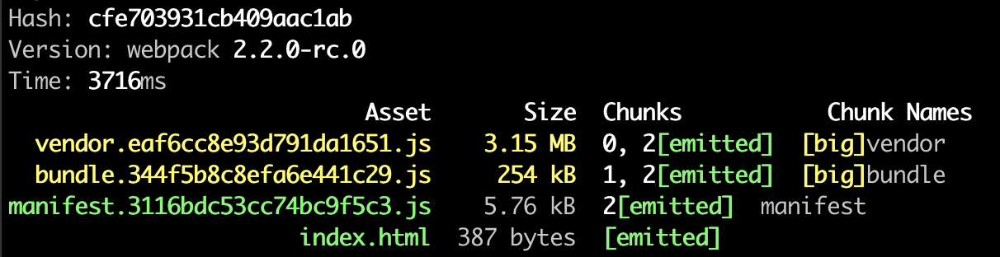
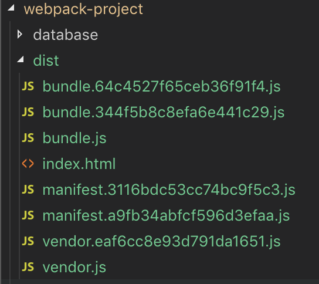
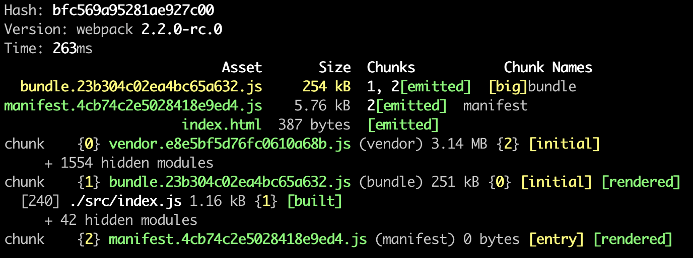

# Webpack 2

## Introdution
- Why do we need Webpack?
    - Server side templating: Back end server creates an HTML doc and sends it to the user.
    - Single page app: Server sends a bare-bones HTML doc to the user. Javascript runs on the users machine to assemble a full webpack.
    - Modern websites are using single page app. It relies on Javascript code that is executed on user's browser to assemble the entire web application, so we have huge pile of Javascript that is shipped down to user's browser. Webpack deals with this tremendous amount of Javascript code easier.
    - Problem: It's hard to update or change codes in single page app, because the source code is thousand or million lines of Javascript.
    - Javascript modules: It contains some small acount of code. But splitting project up into many separate files is not free, per se.
        
        1. Load order: You need to handle the order in which the code is executed.
        1. Performance: Having many JS files and loading them over an HTTP connection decreases the performance. The more files you have, the slower load time for the page.
    - The core purpose of Webpack: It takes big collection of tiny little JS modules and merge them all into one big JS file while also ensuring that each module is executed in the correct order.
        
- Module system

    Module System|Common Syntax
    --|--
    CommonJS|`module.exports`, `require`
    AMD|`define`, `require`
    ES2015|`export`, `import`

- Webpack in action
    1. Create a folder called `js_modules` and get in it.
        ```
        $ mkdir js_modules
        $ cd js_modules
        ```
    1. Make a new npm project. Just press enter to go through all questions.
        ```
        $ npm init
        ```
    1. You can see `package.json` is created.
        ```
        $ ls
        package.json
        ```
    1. Create a new folder called `src`, and create 2 files `index.js` and `sum.js` in this folder.
    1. Link files with CommonJS, notice that `sum.js` should be loaded before `index.js` in this case.
        ```js
        // sum.js
        const sum = (a, b) => a + b;

        module.exports = sum;
        ```
        ```js
        // index.js
        const sum = require('./sum');

        const total = sum(10, 5);
        console.log(total);
        ```
    1. Install Webpack 2.
        ```
        $ npm install --save-dev webpack@2.2.0-rc.0
        ```
    1. Move to folder `js_modules` and create a file `webpack.config.js`. In this file we can set up the configuration of webpack. There are 2 minimum properties that we have to define inside of this file.
        1. Entry property: In webpack project, we call the entry file of the application `index.js`. `index.js` is a entry point, so it only imports code to it and doesn't export anything and is not depended upon by anything else. When you refer to `index.js` as entry point (set it to entry property), webpack will do 2 things:
            - It will instruct webpack on the first file that it should execute when application starts up.
            - Entry file forms the start of the module-building process. So webpack will look at what entry point file imports and then look at what those files import and go on until the files which have no dependenies.
        1. Output property: It tells webpack where to take this big all `bundle.js`. The `path` property is a reference to the directory that the output file should be saved to. `filename` is what webpack should call the actual file that gets created. By convention, we name it `bundle.js`. Notice that you need to use absolute path in `path` property.
            ```js
            // This is handled by node.js runtime instead of webpack.
            const path = require('path');

            const config = {
                entry: './src/index.js',
                output: {
                    // Save output file called bundle.js inside of a path of the current working directory in a file called build.
                    path: path.resolve(__dirname, 'build'),
                    filename: 'bundle.js'
                }
            };

            module.exports = config;
            ```
    1. Open `package.json` file, add script as follows:
        ```js
        {
            ...
            "scripts": {
                "build": "webpack"
            },
            ...
        }
        ```
    1. Run webpack.
        ```
        $ npm run build
        ```
        
    1. Create a html file `index.html`.
        ```html
        <head>
        </head>
        <body>
            <script src="build/bundle.js"></script>
        </body>
        ```
    1. Open `index.html` and check the console. The console will show `15`.
        ```
        $ open index.html
        ```
- Why should we use command `npm run build` instead of `webpack`?
    - `webpack`: Out of all globally installed modules, find the one called webpack and run it. So you need install webpack globally.
    - `npm run build`: Run the copy of webpack stored in the `node_modules` directory.
    - If different projects use different version of webpack, command `webpack` cannot handle it.
- Pseudo code of `bundle.js` as follows:
    ```js
    var myModules = [
        function() {
            const sum = (a, b) => a + b;
            return sum;
        },
        function() {
            const sum = myModules[0]();
            const total = sum(10, 10);
            console.log(total);
        }
    ];

    var entryPointIndex = 1;
    myModules[entryPointIndex]();
    ```
## Handling Project Assets
- Module loaders: They are used to do some preprocessing on files before they are added to the `bundle.js`. For example, Babel is a loader which turns ES2015 code into ES5.
- There are 3 separate modules to get Babel working:
    1. `babel-loader`: Teaches babel how to work with webpack.
    1. `babel-core`: Knows how to take in code, parse it, and generate some output files. Notice that this module doesn't transpile or transform any code, that's a job for `babel-preset-env`.
    1. `babel-preset-env`: Ruleset for telling babel exactly what pieces of ES2016/6/7 syntax to look for, and how to turn it into ES5 code.
- Install these 3 separate modules.
    ```
    npm install --save-dev babel-loader@7 babel-core babel-preset-env
    ```
- Configuration
    - Refence code in `webpack.config.js`:
        ```js
        const config = {
            ...
            module: {
                rules: [
                    {
                        use: 'babel-loader',
                        test: /\.js$/
                    }
                ]
            }
        };
        ```
    - `use`: If we want to use loaders in webpack, we need to add a new property `module` in `webpack.config.js`. In this property, `rules` means loaders, which is an array, so you can use many loaders in webpack.
    - `test`: It's a regular expression. `/\.js$/` means jf file name ends with `.js`, babel will be applied. Because we don't want to apply this loader on, e.g., `.css`, `.html` file.
    -  But we still need another setting to tell Babel how to transform the code. So create a file called `.babelrc` to use `babel-preset-env`.
        ```babelrc
        {
            "presets": ["babel-preset-env"]
        }
        ```
- Run `npm run build` to check `bundle.js` again. You'll see the `const` and `=>` in [sum.js](./js_modules/src/sum.js) is translated to ES5 code as follows.
    ```js
    // sum.js
    const sum = (a, b) => a + b;
    ```
    ```js
    // bundle.js
    var sum = function sum(a, b) {
        return a + b;
    };
    ```
- Refactor to ES2015 modules.
    ```js
    // sum.js
    const sum = (a, b) => a + b;

    export default sum;
    ```
    ```js
    // index.js
    import sum from './sum';

    const total = sum(10, 5);
    console.log(total);
    ```
- Handle CSS
    - Create a file named `image_viewer.js` to render the HTML.
        ```js
        const image = document.createElement('img');
        image.src = "http://loremflickr.com/400/400";

        document.body.appendChild(image);
        ```
    - Import `image_viewer.js` in `index.js`. Notice that we don't export any code in `mage_viewer.js`, and `index.js` don't need any code in `mage_viewer.js` too. Import this file just make sure it will be executed.
        ```js
        import './image_viewer';
        ...
        ```
    - CSS loaders
        - `css-loader`: Knows how to deal with CSS imports.
        - `style-loader`: Takes CSS imports and adds them to the HTML document.
    - Install CSS loaders
        ```
        $ npm install --save-dev style-loader css-loader
        ```
    - Create a file called `image_viewer.css` under `js_modules/styles` directory.
        ```css
        img {
            border: 10px solid black;
        }
        ```
    - Import CSS in `image_viewer.js`.
        ```js
        import '../styles/image_viewer.css';
        ...
        ```
    - CSS loader configuration as follows. Notice that if you have several loaders, you can use an array in `use`. These **loaders are applied from right to left**.
        ```js
        const config = {
            ...
            module: {
                rules: [
                    ...
                    {
                        use: ['style-loader', 'css-loader'],
                        test: /\.css$/
                    }
                ]
            }
        };
        ```
    - Run the webpack again, and open the browser to check the black border. You can inspect the web page, you'll see the CSS is in the `header`.<br />
        
- How do webpack somehow modify the HTML structure of the document (apparently, there is no tie between webpack and HTML)?
    - Webpack is not necessarily modifying the `index.html`. Style loader takes the modules inside of `bundle.js` and then it manually injects that into the HTML after the script is loaded up.
    - This approach has some downsides. Loading CSS in a separate file is a lot faster than loading up all of the JS and CSS in a single file, because of how the browser handles parallel download requests. See the following section to learn more.
- Separate CSS from `bundle.js`
    - Install `extract-text-webpack-plugin` .
        ```
        $ npm install --save-dev extract-text-webpack-plugin@2.0.0-beta.4
        ```
    - Update `webpack.config.js`. `loader` and `use` are identical, but you need to use `loader` when using this plugin owing to development stage. Lines of `plugins` tells the extract text library to find any files that were transformed by its loader (here is file end with `.css`) and then saves into a file called `style.css`. If there's more than one CSS files, they will all be combined into a single `style.css` file.
        ```js
        const ExtractTextPlugin = require('extract-text-webpack-plugin');

        const config = {
            ...
            module: {
                rules: [
                    ...
                    {
                        loader: ExtractTextPlugin.extract({
                            loader: 'css-loader'
                        }),
                        test: /\.css$/
                    }
                ]
            },
            plugins: [
                new ExtractTextPlugin('style.css')
            ]
        };
        ```
    - Update `index.html` to load separated file.
        ```html
        <head>
            <link rel="stylesheet" href="build/style.css" >
        </head>
        ```
    - Restart the npm and check browser, you will see the same result, and it is `<link>` tag instead of `<style>` tag in the header.<br />
        
    - You'll notice this method still have problems, that is the speed of loading image is too slow, so you'll see the border first.
- Handling image loading
    - Loaders: `image-webpack-loader` will resize (compress) the image. `url-loader` will take the compressed image, if it is small, it will include inside of the `bundle.js` as the raw data that image consists of. Otherwise, the image will be saved into the build directory.<br />
        
    - Install loaders.
        ```
        $ npm install --save-dev image-webpack-loader url-loader
        ```
    - Update `webpack.config.js`. It will find `.jpeg`, `.jpg`, `.png`, `.gif`, and `.svg` files to apply the loaders. 40,000 bytes (40kB) is the reference, if image greater than this size then save it as a separate file. Otherwise, include it into the `bundle.js` output.
        ```js
        ...
        const config = {
            ...
            module: {
                rules: [
                    ...
                    {
                        test: /\.(jpe?g|png|gif|svg)$/,
                        use: [
                            {
                                loader: 'url-loader',
                                options: { limit: 40000 }
                            },
                            'image-webpack-loader'
                        ]
                    }
                ]
            },
            ...
        };
        ```
- Image loading in action
    1. Create a new folder named `assets` and put a large image (>40kB) and small image (<40kB) in it. You can refer to [assets](.js_modules/assets/) folder.
    1. Import those file in `image_viewer.js`.
        ```js
        import big from '../assets/big.jpg';
        import small from '../assets/small.jpg';

        const image = document.createElement('img');
        image.src = "http://loremflickr.com/400/400";

        document.body.appendChild(image);
        ```
    1. Run npm build. Notice that you might need to install `file-loader` first to import them successfully.
        ```
        $ npm install --save-dev file-loader
        ```
    1. Check results:
        - After running, you can find a JPG file been built in console log. You can also check the `build` file, there is a big image in there.<br />
            
        - You can check the `bundle.js` to see the small image in raw data (long string) .
            ```js
            ...
            Object.defineProperty(exports, "__esModule", { value: true });
            /* harmony default export */ exports["default"] = "data:image/jpeg;base64,/9j/4AAQSkZJRgABAQAAAQABAAD//gA+Q1JF......";
            ...
            ```
        - But what's `big` and `small` variable in `image_viewer.js`?
    1. Update `image_viewer.js` as follows:
        ```js
        import big from '../assets/big.jpg';
        import small from '../assets/small.jpg';
        import '../styles/image_viewer.css';

        const image = document.createElement('img');
        image.src = small;

        document.body.appendChild(image);

        const bigImage = document.createElement('img');
        bigImage.src = big;

        document.body.appendChild(bigImage);
        ```
    1. Run npm build again, you'll notice the big image cannot be resolved. Because `small` variable is string (raw data) directly, but `big` is also a string, but when we want to import it in `image_viewer.js`, the path is wrong.
        
    1. Add `publicPath` config in `webpack.config.js`. When you define `publicPath`, URL loader will take the value (`build/`) and prepend it to the URL. Actually this property is also used by any other loader that produces a direct file path reference to a file in the output directory.
        ```js
        const config = {
            ...
            output: {
                path: path.resolve(__dirname, 'build'),
                filename: 'bundle.js',
                publicPath: 'build/'
            },
            ...
        }
        ```
    1. Run npm build to check the images are displayed successfully.
## Performance with Webpack
- When there are 2 screen in the applications as follows, we want to load just minimum amount of code to show the login form, after user logins successfully, we'll load the rest of JS. But if we just only have one `bundle.js`, we cannot separate the code for loading step by step, so we need code splitting.
    

- Practice
    1. Design figure as follows:
        
    1. Update `src/index.js` file. When user clicks button, it will import `image_viewer`. This action is async, so we need to wait some time for getting results.
        ```js
        const button = document.createElement('button');
        button.innerHTML = 'Click me';
        button.onclick = () => {
            System.import('./image_viewer').then(module => {
                module.default();
            })
        }

        document.body.appendChild(button);
        ``` 
    1. Update `image_viewer.js` file.
        ```js
        import small from '../assets/small.jpg';
        import '../styles/image_viewer.css';

        export default () => {
            const image = document.createElement('img');
            image.src = small;

            document.body.appendChild(image);
        }
        ```
    1. Run npm build. Open `Inspect` of browser and check `Network` tag and see `JS` file only.
        - Before click:<br />
        
        - After click:<br />
        
## Webpack Project
- You need to download the project first, you can clone project by using following code. After downloading, install project dependencies by `npm install`.
    ```
    $ git clone https://github.com/StephenGrider/WebpackProject.git
    ```
- Setting up Babel
    - Exclude: Don't apply babel on any files located inside of `node_modules`.
        ```js
        module: {
            rules: [
                {
                    use: 'babel-loader',
                    test: /\.js$/,
                    exclude: /node_modules/
                },
                {
                    use: ['style-loader', 'css-loader'],
                    test: /\.css$/
                }
            ]
        }
        ```
    - Presets: create a file `.babelrc` as follows. `react` means that do not handle the transpilation of JSX over to raw JS.
        ```babelrc
        {
            "presets": ["babel-preset-env", "react"]
        }
        ```
    - Run npm build, you'll find some warning show up. Because `bundle.js` is more than recommended size 250 kB. Now you can open html to see this application.
        ```
        $ open index.html
        ```
- Vendor code
    - Caching: If the user (browser) have downloaded the JS file before, then user don't need to download it again in the future.
    - `vendor.js` consists of all third-party dependencies, this part isn't updated too frequently compare to codebase. So we can separate `vendor.js` from `bundle.js` to do some caching.
    - We separate output to 2 files, use `[name].js` to fit key in the `entry` to build the file `bundle.js` and `vendor.js`.
        ```js
        entry: {
            bundle: './src/index.js',
            vendor: VENDOR_LIBS
        },
        output: {
            path: path.join(__dirname, 'dist'),
            filename: '[name].js'
        }
        ```
    - Define `VENDOR_LIBS` to list the dependencies you want to put in `vendor.js`.
        ```js
        const VENDOR_LIBS = [
            "faker", "lodash", "react", "react-dom",
            "react-input-range", "react-redux",
            "react-router", "redux",
            "redux-form", "redux-thunk"
        ]
        ```
    - Run npm build, you'll find `vendor.js` is built successfully, but the size `bundle.js` is not change. Because we just pull (copy) the dependencies out of bundle.js to build vendor.js, it doesn't mean webpack will automatically find the common modules between the 2 files.
        
    - Add plugin as follows to tell webpack if there are copies or duplicates in any modules, pull them out and only add them to the `vendor` entry point.
        ```js
        plugins: [
            new webpack.optimize.CommonsChunkPlugin({
                name: 'vendor'
            })
        ]
        ```
    - Now we run npm build, we'll don't have duplicate code in `bundle.js` (separate successfully).
        
    - But when you open the application again, you can't see anything. Open console you'll following error messages, why?
        ```
        Uncaught ReferenceError: webpackJsonp is not defined
        ```
    - Because in the `index.html`, we forgot to add `vendor.js` in the `<script>` tag.
    - Install `html-webpack-plugin`. We can use this plugin to add scripts for us automatically.
        ```
        $ npm install --save-dev html-webpack-plugin
        ```
    - We need to move `index.html` under `src` folder, because we want to configure this file now, so it makes sense. Configure in `webpack.config.js` like so, this configuration will automatically find add all the scripts (`bundle.js` and `vendor.js`) that was generated, and add script tags to the `dist/index.html` document.
        ```js
        var HtmlWebpackPlugin = require('html-webpack-plugin');

        module.exports = {
            ...
            plugins: [
                new HtmlWebpackPlugin({
                    template: 'src/index.html'
                })
            ]
        }
        ```
    - Run npm build, application will start successfully.
- Caching problem: The browser will cache the JS file, when we update our code with same name `bundle.js`, the user's browser don't know that's different from previous version. So browser doesn't download the new version.
    - Chunk hash: Use unique hash to identify different version of `bundle.js`.
        ```js
        output: {
            path: path.join(__dirname, 'dist'),
            filename: '[name].[chunkhash].js'
        },
        ```
    - We need to change `CommonsChunkPlugin` setting, if you don't change it, then it will think that vendor is updated too. Now we add a third file called `manifest`. The purpose of `manifest.js` is to tell the browser whether or not the vendor file actually got changed.
        ```js
        plugins: [
            new webpack.optimize.CommonsChunkPlugin({
                names: ['vendor', 'manifest']
            })
        ]
        ```
    - Rebuild the project and you'll see chunk hash after file name.<br />
        
    - Try to add some code in the file and rebuild it, you'll find the bundle file name will be changed but vendor file is same.<br />
        
- Cleaning files
    - You can open the `dist` and you find every time you run build, you'll get a new file. But old files are not removed owing to different name cannot be overridden.<br />
        
    - Install `rimraf`.
        ```
        npm install --save-dev rimraf
        ```
    - Go to `package.json` to set it up.
        ```json
        {
            "scripts": {
                "clean": "rimraf dist",
                "build": "npm run clean && webpack"
            }
        }
        ```
    - Run build and check `dist`.
## Webpack Dev Server
- Webpack dev server is responsible for watching all of project code (files), and automatically rebuilding the project whenever one of the files change. Notice this tool is just for development not for production.
- When we open up the web browser, we will make connection to webpack dev server which will automatically feed us all resources instead of loading up the `index.html`. So we will no longer be manually opening up `index.html`.
- Webpack dev server in action
    1. Install webpack-dev-server.
        ```
        $ npm install --save-dev webpack-dev-server@2.2.0-rc.0
        ```
    1. Add a script in `package.json`.
        ```
        {
            "scripts": {
                "serve": "webpack-dev-server"
            }
        }
        ```
    1. Use `npm run serve` to fire up the service and visit [http://localhost:8080](http://localhost:8080) to check service.
    1. Try to change a file, you'll find when you save this file, webpack dev server will automatically rebuild that file, just one file instead of whole files.<br />
        
    1. Use following commands to clean `dist` and fire up the server again.
        ```
        $ npm run clean
        $ npm run serve
        ```
    1. Open up [http://localhost:8080](http://localhost:8080), you'll see the service is still running although there's no `dict`. That's because server will load files in memory instead of physical files.
## React-specific optimization
- Go to `router.js` to see all pages in the service. We want to separate each file from `bundle.js`.
- We take the existing JSX routes and transform them into some plain route components, see this refactored [router.js](webpack-project/src/router.js). The following code shows that react router will automatically call `getComponent()`, inside of it, we can fetch the code (`import()`) for child component and once it's fetched we'll callback (`cb`) with the component. This callback function means when we get the module (`ArtistCreate`), we can callback with this component and get `module.default`.
    ```js
    {
        path: 'artists/new',
        getComponent(location, cb) {
            System.import('./components/artists/ArtistCreate')
            .then(module => cb(null, module.default))
        }
    }
    ```
- Visit [http://localhost:8080](http://localhost:8080), when you change the page (child component), you'll find browser will load a extra JS file.
- If you've got an application that's only like a handful of different pages, you don't need code splitting like the above way. It's just for the application which has tons of different routes. Notice you cannot use smarter way to go through each `childRoute` by for loop or else, because webpack doesn't have ability to handle string concatenation or interpellation.
## Deployment

